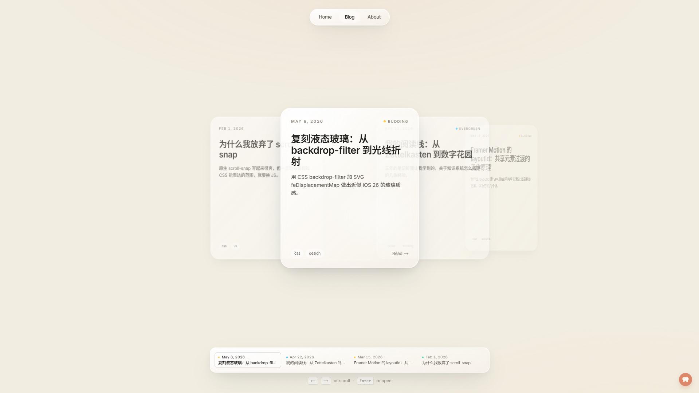

# Notes & Garden

一个个人博客 / 数字花园。轻、淡、克制，主体是一个 3D 滚筒形式的文章浏览体验，每张卡片用 iOS Liquid Glass 风格的液态玻璃质感呈现。



> 截图占位 —— 跑起来后截图替换成 `.github/preview.png` 即可。

## 特性

- **`/blog` 3D 滚筒** — 滚轮一次一张、首尾循环；左右键、Enter、触屏滑动都支持
- **液态玻璃** — `backdrop-filter` + 多层柔阴影 + 跟随鼠标的镜面高光
- **卡片 → 全屏的共享元素过渡** — Framer Motion `layoutId`,标题和日期视觉连续
- **Claude 桌宠** — 像素风小角色，眼睛跟随鼠标、点击说话、可拖动、位置持久化
- **博客系统** — MDX frontmatter + 模块级缓存 + Shiki 代码高亮 + 中文衬线渲染
- **静态导出** — `output: "export"`,可直接部署到 GitHub Pages / Vercel / 任何静态托管

## 技术栈

- [Next.js 15](https://nextjs.org)（App Router，静态导出模式）
- [React 19](https://react.dev)
- [Tailwind CSS v4](https://tailwindcss.com)
- [Framer Motion](https://www.framer.com/motion/)
- [unified](https://unifiedjs.com) + [rehype-pretty-code](https://rehype-pretty-code.netlify.app) + [Shiki](https://shiki.style)
- `next/font` 自托管字体（Inter / Source Serif 4 / Noto Sans SC / Noto Serif SC / JetBrains Mono）

## 本地运行

```bash
npm install --legacy-peer-deps
npm run dev
```

浏览器打开 http://localhost:3000

## 写一篇博客

在 `content/posts/` 下新建一个 `.mdx` 文件，frontmatter 字段如下：

```markdown
---
title: "你的标题"
date: "2026-05-16"
excerpt: "1-2 句摘要,会显示在卡片上"
tags: ["css", "design"]
maturity: "seedling"  # seedling | budding | evergreen
---

正文写在这里。支持 GFM 表格、代码块（自动 Shiki 高亮）、标题等。

# 一级标题
## 二级标题

```ts title="lib/example.ts" {2}
const x = 1;
const y = 2; // 这一行会被高亮
```
```

保存后,新的卡片会自动出现在滚筒里。

## 部署到 GitHub Pages

项目自带 GitHub Actions workflow ([`.github/workflows/deploy.yml`](./.github/workflows/deploy.yml))。

1. **推到 GitHub** —— 把代码 push 到新建的仓库
2. **打开 Pages**: 仓库 Settings → Pages → Source 选 **"GitHub Actions"**
3. 等 Actions 跑完(2-3 分钟)
4. 访问 `https://<你的用户名>.github.io/<仓库名>/`

仓库名规则:
- 取名 `<你的用户名>.github.io` → 站点挂根域名
- 其他名字 → 站点挂在 `/<仓库名>/` 子路径下（workflow 自动检测 basePath）
- **不要**取名 `blog`(会导致 `/blog/blog/foo` 的尴尬路径)

## 项目结构

```
app/
├── layout.tsx          # 根 layout, 字体加载, 桌宠挂载
├── page.tsx            # 首页
├── about/page.tsx      # 关于
├── blog/
│   ├── page.tsx        # 滚筒列表页
│   └── [slug]/page.tsx # 文章详情(深链直访)
└── not-found.tsx       # 404 页

components/
├── BlogDrum.tsx        # 滚筒 + 全屏过渡的核心交互
├── ClaudePet.tsx       # 桌宠
├── GlassCard.tsx       # 玻璃卡片基础元素
└── SiteNav.tsx         # 顶部导航

lib/
├── posts.ts            # 读 MDX 文件 + frontmatter
├── markdown.ts         # unified pipeline + 模块级 HTML 缓存
└── types.ts            # 共享类型

content/posts/          # 博客 MDX 文件
```

## 设计思路

**为什么是滚筒**: 普通博客列表是垂直流, 信息密度高但每篇文章只是一行。滚筒让每篇文章作为一张完整的卡片占据视线中心, 强迫读者一次只看一篇, 与「数字花园」慢节奏阅读契合。

**为什么是液态玻璃**: 站点底色是奶白色,文字是深色,中间需要一层「半透明的容器」让内容浮起来又不喧宾夺主。iOS 26 / macOS Tahoe 的 Liquid Glass 是这个问题的成熟解答。

**为什么有桌宠**: 没必要,但好玩。一个会眨眼会被拖动会随路由换话的小像素角色,让站点从「内容容器」变成「有人在家」。

## License

MIT — see [LICENSE](./LICENSE).
